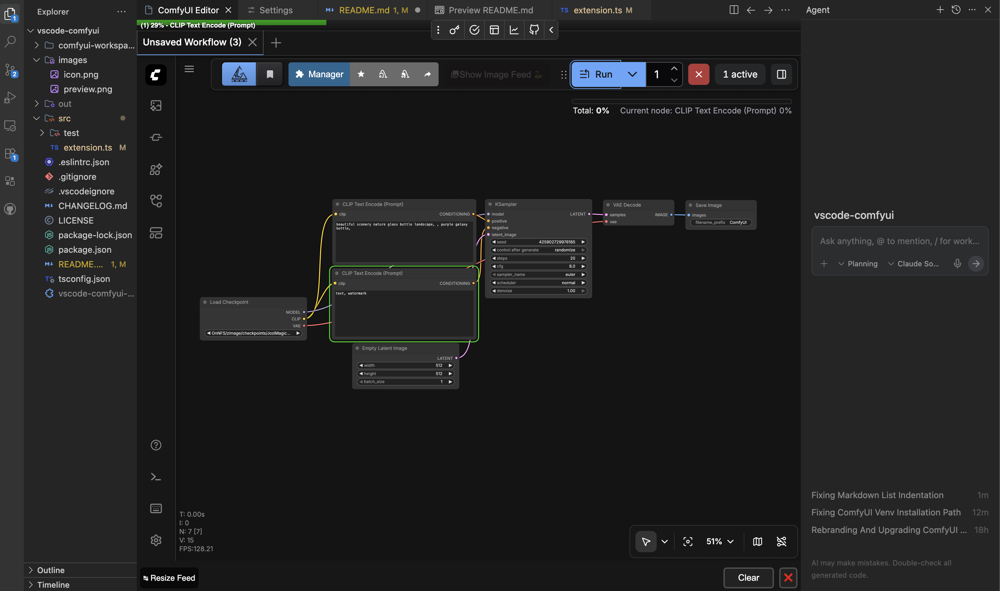

#  VS Code ComfyUI

Interact with ComfyUI directly within your code editor.

[](https://open-vsx.org/extension/scruffynerf/vscode-comfyui)
[](https://github.com/scruffynerf/vscode-comfyui)



## Who is this for?

Are you a developer or technical artist who works with both ComfyUI and code? Tired of constantly switching between windows – your code editor, ComfyUI interface, and terminal windows? This extension is for you!

## Features

- 🎨 **Direct Interaction**: Use ComfyUI directly in your code editor (VS Code, Cursor, Theia, Antigravity, etc.).
- 🌐 **Remote Support**: Connect to a remote ComfyUI server by configuring `comfyui.serverUrl`.
- 🔄 **Quick Reload**: Reload or open the ComfyUI editor panel instantly with `Ctrl+Shift+R`.
- ⚡ **Server Management**: Restart your ComfyUI server with `Ctrl+Shift+Alt+R`. The extension will automatically reload the editor panel after the server becomes responsive. (Requires ComfyUI-Manager or compatible API).
- 📦 **One-Click ComfyUI Installation**: Install and run the [`hiddenswitch`](https://github.com/hiddenswitch/pip-and-uv-installable-ComfyUI) ComfyUI fork via `uv` for a self-contained setup.
  - It's uv/pip installable, lets you use ComfyUI as a Python library, and maintains 99% compatibility with the main repo — highly recommended!
- 🤖 **AI Agent Bridge**: Robust, two-way integration for AI agents. Agents can observe the current graph state, patch it, and trigger queue/interrupt via simple JSON files (see [COMFYUI_AGENT_GUIDE.md](COMFYUI_AGENT_GUIDE.md)). Disable with `comfyui.enableAiFeatures: false` for plain embedded panel mode.
- 📋 **Workflow Summary**: Every time the workflow changes, a `comfyai/workflow-summary.md` is written to the workspace — a human/AI-readable breakdown of inputs, outputs, model loaders, main pipeline, variables, loops, and hints for common tasks. Agents should read this before the raw JSON.

## Requirements

- A running ComfyUI instance (Local or Remote).
- `uv` (optional, for self-contained installation). See [uv installation](https://docs.astral.sh/uv/getting-started/installation/) if you don't have uv installed.

## Common Issues

### Black screen when connecting to a local stock ComfyUI

If you point the extension at your own ComfyUI install and get a black screen, ComfyUI is blocking the connection.

VS Code's webview panel uses a `vscode-webview://` origin. ComfyUI rejects requests from unknown origins with a 403. The fix is to enable the **ComfyUI: Enable Cors Header** setting (enabled by default) — this adds `--enable-cors-header` to the startup args for the embedded webview relay.

You'll also need the bridge custom node for full two-way integration (workflow state sync, patch/queue commands). Use **ComfyUI: Install Integration Node to External ComfyUI...** from the Command Palette and select your ComfyUI's `custom_nodes/` folder.

## Commands

All commands are available via the Command Palette (`Ctrl+Shift+P` / `Cmd+Shift+P`) under the **ComfyUI** category.

| Command | Description | Keybinding |
|---------|-------------|------------|
| **Open/Reload ComfyUI Editor** | Open the ComfyUI webview panel, or reload it if already open | `Ctrl+Shift+R` |
| **Restart ComfyUI Server** | Restart the running server and reload the panel once it responds | `Ctrl+Shift+Alt+R` |
| **Run Hiddenswitch ComfyUI** | Start ComfyUI from the installed workspace. Prompts to install if not found | — |
| **Install Hiddenswitch ComfyUI (Standard)** | Install via `uv pip install` — fast, self-contained, recommended | — |
| **Install Development ComfyUI (Git Clone)** | Clone the repo and install as an editable package for node development | — |
| **Install/Update VSCode Integration Node (Hiddenswitch)** | Update the bridge custom node inside the extension-managed ComfyUI install | — |
| **Install Integration Node to External ComfyUI...** | Install the bridge into any ComfyUI's `custom_nodes` folder via a folder picker | — |
| **Install Agent Workspace** | Deploy the AI agent workspace (`comfyai/`) to the install directory. Run this manually if the workspace doesn't exist and you want to use the agent protocol. | — |
| **Refresh Node Catalog** | Query `/object_info` and rebuild `comfyai/nodes/` (index, per-class lists, raw registry). Also runs silently on panel open. Deployed alongside the appmana pip catalog (2500+ installable packages) and capability index (find packs by what they can do). | — |
| **View Current ComfyUI State (JSON)** | Open the live `comfyai/workflow-state.readonly.json` as a read-only document in the editor | — |
| **Apply Currently Open Workflow JSON** | Load the JSON file in the active editor tab directly into the ComfyUI panel. Requires the bridge custom node to be installed. | — |
| **List Knowledge Contributions** | List agent-written knowledge contributions pending review in `wiki/contributions/` | — |
| **Submit Knowledge Contributions** | Open GitHub issues for pending contributions in `wiki/contributions/` | — |

## Configuration

| Setting | Default | Description |
|---------|---------|-------------|
| `comfyui.serverUrl` | `http://localhost:8188` | URL of your ComfyUI instance. Can be remote. |
| `comfyui.restartEndpoint` | `/v2/manager/reboot` | API endpoint used to restart the server. |
| `comfyui.serverTimeout` | `60000` | Max time (ms) to wait for the server to become responsive on start or restart. |
| `comfyui.installDir` | `comfyui-workspace` | Directory where ComfyUI will be installed. Relative paths resolve from the workspace root; absolute paths are used as-is. |
| `comfyui.venvDir` | `.venv` | Name of the virtual environment directory inside `installDir`. |
| `comfyui.pythonVersion` | `3.12` | Python version for the virtual environment (e.g. `3.12`, `3.11`, `/usr/bin/python3.12`). |
| `comfyui.startupArgs` | _(empty)_ | Extra arguments passed to ComfyUI on startup (e.g. `--listen 0.0.0.0 --port 8189`). |
| `comfyui.installUvAutomatically` | `true` | Automatically install `uv` if it isn't found during installation. |
| `comfyui.gitRepo` | `https://github.com/hiddenswitch/pip-and-uv-installable-ComfyUI.git` | Git repository URL for development installations. |
| `comfyui.defaultBranch` | `main` | Branch to check out for development installations. |
| `comfyui.enableCorsHeader` | `true` | Enable CORS headers for the embedded VS Code webview. Required for the panel to load. Disable only if using an external CORS proxy or accessing a properly configured remote server. |
| `comfyui.enableAiFeatures` | `true` | Enable AI agent integration (state files, summary, node catalog, apply-patch bridge). Set to `false` for plain embedded panel mode. |
| `comfyui.testingMode` | `false` | Enable per-action log file reminders for AI agent sessions. |
| `comfyui.wikiMode` | `false` | Prompt agents to record insights in the wiki/ directory after each action. Recommended for building persistent memory across sessions. |

## Usage

1. Start your ComfyUI server (if external)
2. Open your code editor.
3. Use the Command Palette to run **ComfyUI: Open/Reload ComfyUI Editor**.
4. Use **ComfyUI: Restart Server** after developing custom nodes.

## Installation (Self-Contained)

- **Standard Installation**: Run **ComfyUI: Install Hiddenswitch ComfyUI (Standard)** for a quick uv/pip-based setup using the [Hiddenswitch fork](https://github.com/hiddenswitch/pip-and-uv-installable-ComfyUI).
- **Development Installation**: Run **ComfyUI: Install Development ComfyUI (Git Clone)**. This clones the repository specified in `comfyui.gitRepo` (defaulting to the `hiddenswitch` fork) and performs an editable install. This allows you to use the main ComfyUI repository or any other fork, and potentially work on the ComfyUI codebase itself.

Either should allow you to develop nodes from within `custom_nodes`. Checkout your node development repo inside `custom_nodes` and you should be able to 'live code' your nodes, and see the changes reflected in the editor panel after a server restart/panel reload.

Once installed, run **ComfyUI: Run Hiddenswitch ComfyUI**. The extension will automatically open the ComfyUI editor panel after the server becomes responsive.

## Documentation & Roadmap

- **[COMFYUI_AGENT_GUIDE.md](COMFYUI_AGENT_GUIDE.md)**: Technical details on how AI agents can interact with the ComfyUI bridge.
- **[future_plans.md](future_plans.md)**: Vision and themes for where the extension is headed.
- **[TODO.md](TODO.md)**: Prioritized implementation backlog.
- **[CHANGELOG.md](CHANGELOG.md)**: Detailed release notes.

## Development

**Activation events:** This extension uses `"*"` because it has a file watcher that responds to agent-written files outside the workspace. When packaging:

```bash
vsce package --allow-star-activation
```

## Contributing

Found a bug or want to contribute? Visit our [GitHub repository](https://github.com/scruffynerf/vscode-comfyui).

> [!NOTE]
> This was originally a fork of [piiq/code-comfyui](https://github.com/piiq/code-comfyui) but now has much more extensive AI support, and is maintained by [scruffynerf](https://github.com/scruffynerf).

## License

This extension is licensed under the MIT License.
